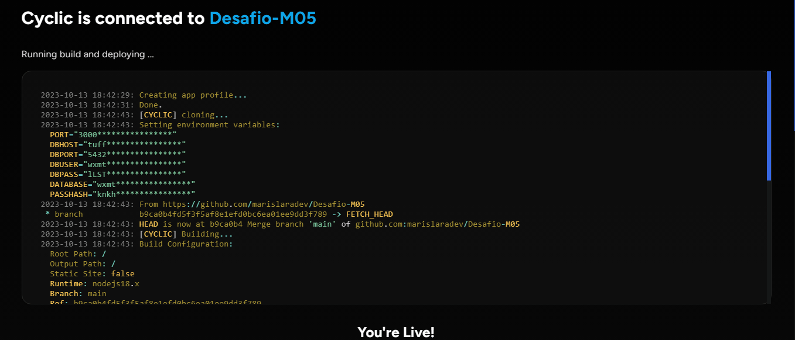
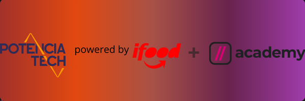

<div align="center"></a></div>
<br>
<br>
<h1>Desafio final Cubos Academy - Backend</h1>

### Desafio desenvolvido para o módulo final do curso Desenvolvimento de Software com foco em Back End da Cubos Academy
<br>

## Descrição do desafio
O desafio consiste em uma equipe de 5 alunas, integrantes da turma B2B-T05 iFood, criarem a API para um PDV (Frente de Caixa). Esse será um projeto piloto, ou seja, no futuro outras funcionalidades serão implementadas. Após a criação dessa API as alunas devem efetuar o deploy da aplicação.

## Requisitos obrigatórios
- A API a ser criada deverá acessar o banco de dados a ser criado pdv para persistir e manipular os dados de categorias, clientes, pedidos, produtos e usuários utilizados pela aplicação.

 - O campo id das tabelas no banco de dados deve ser auto incremento, chave primária e não deve permitir edição uma vez criado.

- Qualquer valor monetário deverá ser representado em centavos (Ex.: R$ 10,00 reais = 1000)

- As rotas detalhar perfil do usuário logado e editar perfil do usuário logado deverão exigir o token de autenticação do usuário logado, recebendo no header com o formato Bearer Token. Portanto, em cada funcionalidade será necessário validar o token informado.

## Funcionalidades
- Listar categorias
- Cadastrar usuário
- Efetuar Login do usuário
- Detalhar perfil do usuário logado
- Editar perfil do usuário logado
 
 ## Tecnologias usadas
</a>

**Javascript, Node.js, Express.js, PostgreSQL, Npm, Git, Jwt, Bcrypt, Knex, Nodemon, ElephantSQL, Cyclic**

## Deploy
Optamos por utilizar para o deploy da aplicação a plataforma <a href="https://www.cyclic.sh" target="_blank">Cyclic</a>. Com a Cyclic o processo pode ser simplificado e automatizado gratuitamente. No artigo <a href="https://blog.cubos.academy/deploy-do-backend-na-cyclic/#" target="_blank">O que você precisa saber sobre o deploy do backend na Cyclic</a>,  Guido Cerqueira destaca seus benefícios e as etapas práticas necessárias para configurar e iniciar o deploy. 

Abaixo nosso projeto no ar:


## Como executar o projeto
Para executar o projeto em sua máquina é necessário ter Node.js e Postgresql instalados e configurados. Recomendamos também a IDE BeeKeeper para visualização do banco de dados e Insomnia para teste das rotas, embora você possa usar softwares e ferramentas de sua escolha como alterntiva a essas duas tecnologias.

> Execução do projeto:

1- Faça um fork do projeto

2- Clone o seu fork para sua máquina

3- Execute o comando abaixo para instalar as dependêncaias de desenvolvimento:
```bash
npm install
```

4- Verifique o funcionamento do servidor com o comando:
```bash
npm run dev
```

Algo como a imagem abaixo deve aparecer no seu terminal indicando que o servidor está funcionando:


## Testando
Recomendamos o Insomnia para os testes mas caso prefira é possível utilizar outras ferramentas. Você pode testar nosso projeto em sua máquina utilizando:

http://localhost:3000 (para teste local) 

https://modern-gray-purse.cyclic.app/ (para teste remoto)

Aqui está uma lista das principais rotas da API:

| Método | Rota                              | Descrição                                          |
| ------ | --------------------------------- | -------------------------------------------------- |
| `GET`   | `/categoria`                     | Lista as categorias de produtos.                         |
| `POST`   | `/usuario`                    | Criar um novo usuário. Preencher no Json os campos nome, email e senha.                            |
| `POST`    | `/login`                           | Faz login do usuário. Preencher no Json email e senha.                        |
  
       Todas as rotas a seguir exigem o token de autenticação do usuário logado no header com o formato Bearer Token. Portanto, será necessário validar o token informado.

|        |                                   |                                                              |
| ------ | --------------------------------- | -------------------------------------------------- |
| `GET`   | `/usuario`                     | Lista dados do usuáro logado.                         |
| `PUT`   | `/usuario`                    | Altera dados do usuário logado. Preencher no Json nome, email e senha a serem alterados.                            |
| `POST`    | `/produto`                           | Permite o usuário logado cadastrar um novo produto no sistema.                        |
| `PUT`    | `/produto/:id`                       | Permite o usuário logado a atualizar as informações de um produto cadastrado.                         |
| `GET`  | `/produto`                       |  Lista todos os produtos cadastrados.      |
| `GET`    | `/produto/:id`                           | Permite o usuário logado obter um de seus produtos cadastrados.
| `DELETE`    | `/produto/:id`                           | Essa é a rota que será chamada quando o usuário logado quiser excluir um de seus produtos cadastrados.                        |
| `POST`   | `/cliente`                     | Permite usuário logado cadastrar um novo cliente no sistema.                         |
| `PUT`   | `/cliente/:id`                    | Permite o usuário realizar atualização de um cliente cadastrado.                            |
| `GET`    | `/cliente`                           | Essa é a rota que será chamada quando o usuário logado quiser listar todos os clientes cadastrados.                        |
| `GET`   | `/cliente/:id`                     | Essa é a rota que será chamada quando o usuário logado quiser obter um de seus clientes cadastrados.                         |
| `POST`   | `/pedido`                    | Essa é a rota que será utilizada para cadastrar um novo pedido no sistema.                            |
| `GET`    | `/pedido`                           | Essa é a rota que será chamada quando o usuário logado quiser listar todos os pedidos cadastrados.                        |

<br>

Abaixo exemplo de teste da rota cadastro de usuários no Insomnia:


## Contribuições
Se você deseja contribuir:

- Faça um Fork do projeto.

- Clone o Fork feito para sua máquina.

- Faça suas contribuições.

- Abra uma Solicitação de Pull Request para o branch "main".

- Aguarde discussão e possível aprovação.

Agradecemos antecipadamente pelo interesse.

## Agradecimentos
<div align="center">

 </div>

Agradecemos a nossa professora Isabella Nunes; nossa representante de turma Jules; o monitor Lucas Oliveira; os professores Guido Cerqueira, José Messias Junior e Guilherme Bernal; ao Potência Tech, iniciativa do iFood que nos conectou; e também a todos da Cubos Academy.

## Autoras
<table>
    <tr>
        <td align="center">
            <a href="https://www.linkedin.com/in/aline-santana-silva/" target="_blank">
                
                <br />
                <sub><b>Aline Santana</b></sub>
            </a>
        </td>
        <td align="center">
            <a href="https://www.linkedin.com/in/bruna-fraga-dev/" target="_blank">
                
                <br />
                <sub><b>Bruna Fraga</b></sub>
            </a>
        </td>
        <td align="center">
            <a href="https://www.linkedin.com/in/gabriela-thially-69771b221/" target="_blank">
                
                <br />
                <sub><b>Gabriela Thially</b></sub>
            </a>
        </td>
        <td align="center">
            <a href="https://www.linkedin.com/in/mariana-da-silva-lara-380871285/" target="_blank">
                
                <br />
                <sub><b>Mariana da Silva Lara</b></sub>
            </a>
        </td>
        <td align="center">
            <a href="https://www.linkedin.com/in/paularml/" target="_blank">
                
                <br />
                <sub><b>Paula R. M. Leite</b></sub>
            </a>
        </td>
    </tr>
</table>

## Licença
Este projeto esta sobe a licença [MIT](./License).
<br>

---

###### tags: `back-end` `nodeJS` `PostgreSQL` `API REST` `desafio` `API` `pdv` `cubos academy`


