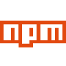

<div align="center"></a></div>
<br>
<br>
<h1>Desafio final Cubos Academy - Backend</h1>

### Desafio desenvolvido para o módulo final do curso Desenvolvimento de Software com foco em Back End da Cubos Academy
<br>

## Descrição do desafio
O desafio consiste em uma equipe de 5 alunas, integrantes da turma B2B-T05 iFood, criarem a API para um PDV (Frente de Caixa). Esse será um projeto piloto, ou seja, no futuro outras funcionalidades serão implementadas. Após a criação dessa API as alunas devem efetuar o deploy da aplicação.

## Requisitos obrigatórios
- A API a ser criada deverá acessar o banco de dados a ser criado pdv para persistir e manipular os dados de categorias, clientes, pedidos, produtos e usuários utilizados pela aplicação.

 - O campo id das tabelas no banco de dados deve ser auto incremento, chave primária e não deve permitir edição uma vez criado.

- Qualquer valor monetário deverá ser representado em centavos (Ex.: R$ 10,00 reais = 1000)

## Funcionalidades
- Listar categorias
- Cadastrar usuário
- Efetuar Login do usuário
- Detalhar perfil do usuário logado
- Editar perfil do usuário logado
 
 ## Tecnologias usadas
</a>

**Javascript, Node.js, Express.js, Postgresql, Npm, Git, Jwt, Bcrypt, Knex, nodemon**

## Como executar o projeto
Para executar o projeto em sua máquina é necessário ter Node.js e Postgresql instalados e configurados. Recomendamos também a IDE BeeKeeper para visualização do banco de dados e Insomnia para teste dos Endpoints, embora você possa usar softwares e ferramentas de sua escolha como alterntiva a essas duas tecnologias.

> Execução do projeto:

1- Faça um fork do projeto

2- Clone o seu fork para sua máquina

3- Execute o comando abaixo para instalar as dependêncaias de desenvolvimento:
```bash
npm install
```

4- Inicie o servidor com o comando:
```bash
npm run dev
```


